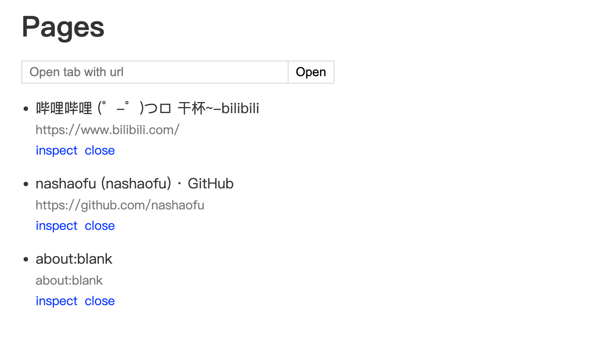
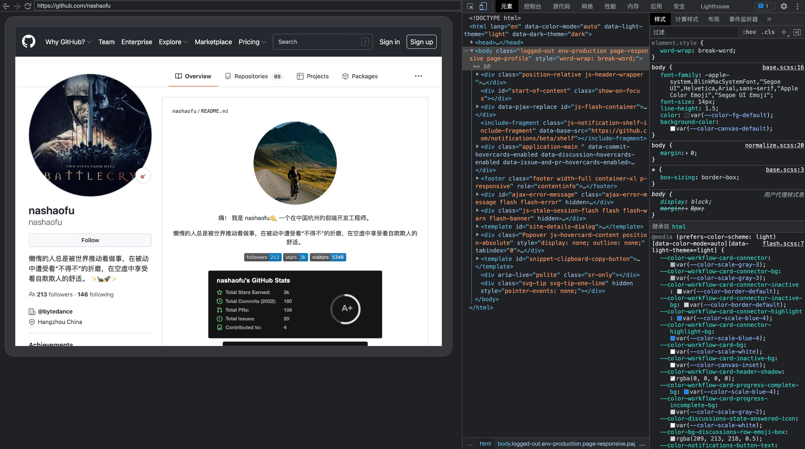

# ydebugger

让你的平板不再吃灰，不再买前生产力，买后爱奇艺，为平板设备 web 开发者工具，可使用 Github codespace & codeserver 进行 web 开发。调试界面基于 Chrome Devtools。

## Usage

```bash
npm i -g ydebugger

ydebugger https://www.google.com
```

## Screenshots

- 所有可调试页面



- 调试页面



## Options

```bash
ydebugger <url>

Positionals:
  url  debugging website url  [string]

Options:
  -h, --help       Show help  [boolean]
  -v, --version    Show version number  [boolean]
  -p, --port       devtools frontend port number  [number] [default: 8080]
  -o, --open       Open browser automatically  [boolean] [default: false]
      --width      viewport width  [number] [default: 1024]
      --height     viewport width  [number] [default: 768]
      --mobile     viewport is mobile  [boolean] [default: false]
      --landscape  viewport is landscape  [boolean] [default: false]
      --touch      viewport is touch supported  [boolean] [default: false]
      --dsf        viewport device scale factor  [number] [default: 2]
```

## Github Codespaces

调试非英文网站，会出现页面字符乱码问题，这种情况是由于系统缺少相应语言的字体文件，可把对应语言字体文件放到`~/.fonts`或者`/usr/share/fonts`下即可。例如使用[HarmonyOS Sans](https://developer.harmonyos.com/cn/docs/design/des-guides/font-0000001157868583)字体渲染中文。

```bash
curl -o HarmonyOS_Sans.zip https://communityfile-drcn.op.hicloud.com/FileServer/getFile/cmtyPub/011/111/111/0000000000011111111.20211104104632.29664895974930825801937957883629:50521103025534:2800:1C62D8D976C9EAB505E2AAE22BD5B04FB5E6E311A8C39626B70F3F5BCF941EF9.zip\?needInitFileName\=true

unzip -d ~/.fonts/ HarmonyOS_Sans.zip
```
